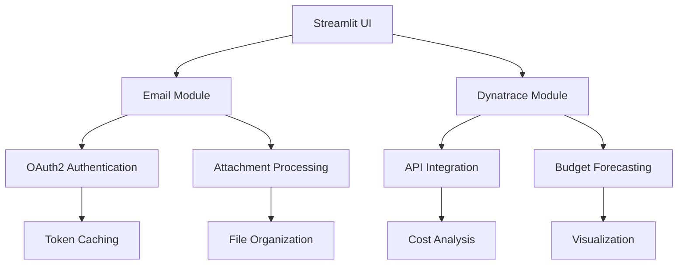

# Automated Notify System 🔔

A comprehensive automation platform integrating email processing and Dynatrace license management with real-time dashboards.

## Features ✨
- 📧 IMAP email monitoring with OAuth2 authentication
- 📦 Automatic attachment processing and organization in `ans/` directory
- 🔐 Secure credential management using Microsoft Authentication Library
- 📊 Interactive Streamlit dashboard with Plotly visualizations
- ⏰ Dynatrace subscription tracking with budget forecasting
- 📈 Cost analysis and automated client reporting
- 🔔 Threshold-based email notifications

## Installation 💻
```bash
pip install -r requirements.txt
```

## Configuration ⚙️
1. Configure Dynatrace accounts through the sidebar interface
2. Grant application permissions for email access

## Usage 🚀
```bash
streamlit run app.py
```

### Email Attachment Viewer 📩
- Real-time monitoring of specified email accounts
- Filter attachments by sender/keyword
- Automatic organization by date metadata
- Clear cache functionality

### Dynatrace Tracker 📊
- Multi-account credential management
- Subscription lifecycle monitoring
- Budget forecasting with visual donut charts
- Cost analysis across custom date ranges
- Automated client reporting via email

## Technical Architecture 🧠

